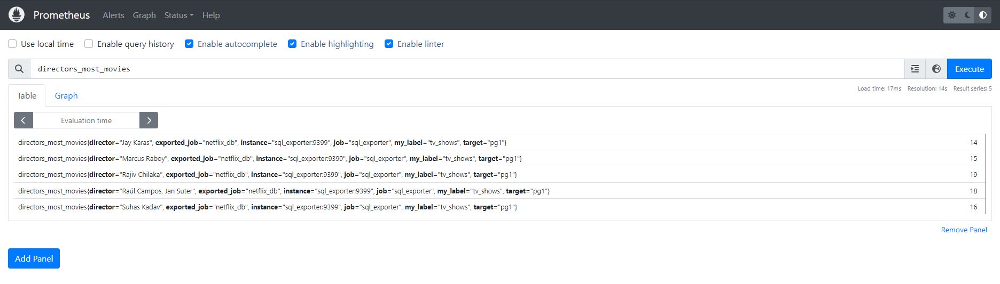
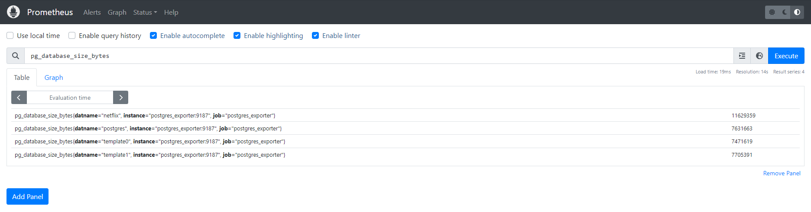

# Simple example of using PostgreSQL exporters

### [postgres_exporter](https://github.com/prometheus-community/postgres_exporter)
**quay.io/prometheuscommunity/postgres-exporter**

A PostgreSQL metric exporter for Prometheus


> Used for DB metrics and config info (system monitoring)


### [sql_exporter](https://github.com/burningalchemist/sql_exporter/)
**burningalchemist/sql_exporter**

Database agnostic SQL exporter for Prometheus - for SQL Queries. 

> Used to create SQL queries to the database, receive and output business metrics (to display real-time data from the database in Grafana)


### Run

```bash
docker compose up -d
```

### Import demo data for testing

```ash
docker compose exec db bash
psql -U pguser -d netflix < /tmp/netflix.sql 
```

Find the directors with the most movies in the database `sql_collectors/netflix.collector.yml`:
```SQL
SELECT 
    director,
    COUNT(*) AS "Number of Movies"
FROM 
    netflix_shows
WHERE 
    type = 'Movie' and director is not null
GROUP BY 
    director
ORDER BY 
    "Number of Movies" DESC
LIMIT 5;
```

#### SQL Exporter


#### PostgreSQL exporter

